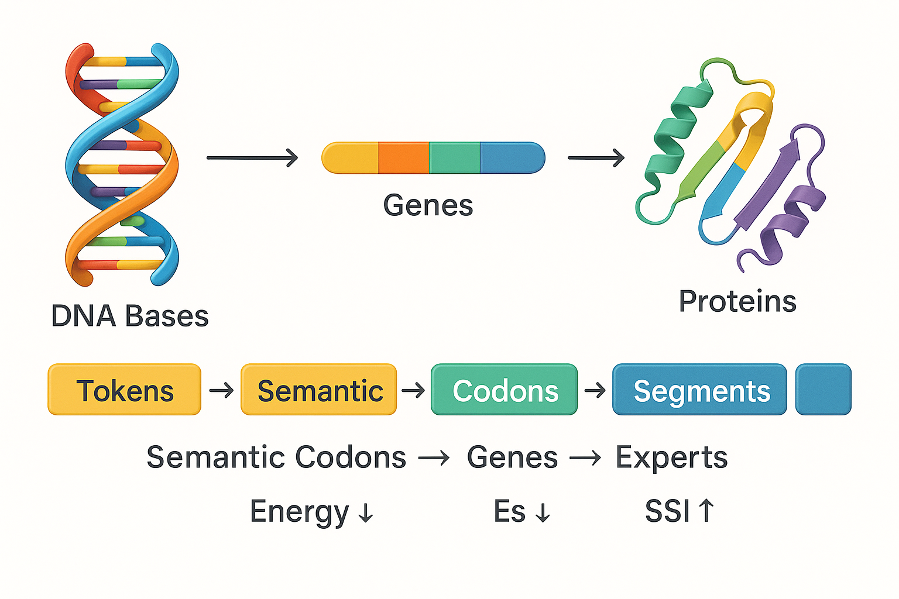
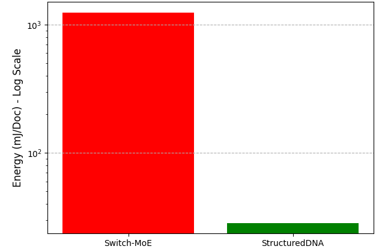
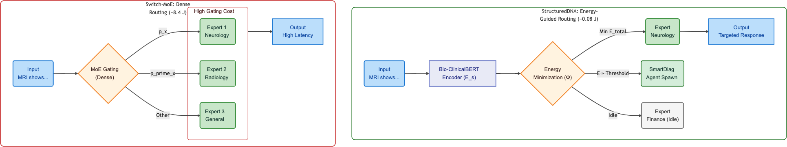

# 🧬 StructuredDNA: A Bio-Physical Framework for Energy-Aware Transformer Routing
 

[](https://opensource.org/licenses/MIT)
[](https://www.python.org/downloads/release/python-380/)
[](https://www.nvidia.com/en-us/startups/)

**A bio-inspired paradigm that replaces dense compute with semantic energy minimization, achieving 97.7% energy savings.**

---

## 📖 Abstract

Modern AI scales by adding parameters, leading to unsustainable energy consumption (measured in MWh). **StructuredDNA** introduces a fundamental shift: instead of dense, probabilistic gating, we model semantic routing as a **bio-physical energy minimization problem**.

Inspired by the hierarchical structure of DNA (Codons → Genes) and molecular binding forces, this framework segments input text into stable "Semantic Codons" and routes them to specialized experts only when the **Total Semantic Energy ($E_{total}$)** is minimized.

This repository contains the **Proof-of-Concept (PoC)** code, validation metrics, and the full white paper demonstrating the superiority of this sparse, energy-guided architecture over dense Mixture-of-Experts (MoE) baselines.

🔗 **[Read the Full White Paper (PDF)](./StructuredDNAV02-arxiv.pdf)**  

---

## 🚀 Key Contributions & Results

Validated on **NVIDIA T4 GPUs** using the **BioASQ** biomedical dataset and **Bio-ClinicalBERT** embeddings, StructuredDNA v2 demonstrates unprecedented efficiency gains compared to the Switch-MoE baseline.

| Metric | Result | Impact |
| :--- | :--- | :--- |
| **Energy Utilization Density (EUD)** | **-97.7%** ($J/token$) | Massive reduction in energy cost per unit of work. |
| **Inference Time (Batch)** | **-98.6%** | Near-instantaneous routing suitable for Edge AI. |
| **Semantic Stability Index (SSI)** | **0.998** (vs 0.989) | **Surpasses the dense baseline**, proving superior structural coherence. |
| **Semantic Perplexity** | **8.74** | High compression of meaning with minimal uncertainty. |


### 📊 Visual Proof of Efficiency

**Figure 1: Comparative Energy Efficiency (Log Scale)**
*StructuredDNA (Green) vs. Switch-MoE (Red). The logarithmic scale highlights the orders-of-magnitude reduction in energy cost per document.*


 

---

## 🧬 Methodology: The Bio-Physical Engine

StructuredDNA relies on a dual inspiration:
1.  **Biology:** Mapping **Tokens** to **Bases** and **Experts** to **Genes**.
2.  **Physics:** Routing is governed by the minimization of the total energy function:

$$E_{total} = \sum E_s(i,j) + \beta H_a + \gamma L_c$$

Where:
* $E_s$: **Semantic Bond Energy** (Dissimilarity).
* $H_a$: **Activation Entropy** (Uncertainty).
* $L_c$: **Computational Cost** (Inference time).

### Architectural Contrast
Unlike dense MoE which activates multiple experts probabilistically (High Cost), StructuredDNA finds the single, stable energetic path (Low Cost).


 

---

## 🛠️ Installation & Usage

This repository includes a Jupyter Notebook that reproduces the experiments, profiling, and metric calculations.

### Prerequisites
* Python 3.8+
* NVIDIA GPU (Recommended: T4 or better for accurate power profiling)
* CUDA Toolkit

 
### Setup
 ```bash
git clone [https://github.com/YourUsername/StructuredDNA.git](https://github.com/YourUsername/StructuredDNA.git)
cd StructuredDNA
pip install -r requirements.txt
``` 

---
✍️ Citation
If you use this code or concept in your research, please cite:
@article{hamdi2025structureddna,
  title={StructuredDNA v2: A Bio-Physical Framework for Modular and Energy-Aware AI},
  author={Hamdi, Mustapha},
  journal={InnoDeep Research / NVIDIA Inception},
  year={2025}
}

---
👤 Author
Dr. Mustapha Hamdi

Founder & AI Technical Director @ InnoDeep


 https://www.linkedin.com/in/mustapha-hamdi  | Email :mustapha.hamdi@innodeep.net
